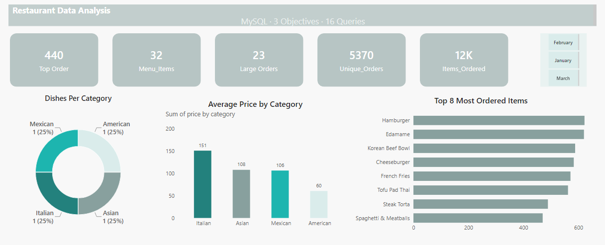

# restaurant-order-data-analysis
 A structured SQL project exploring menu items, order volumes, and customer spending behavior across a restaurant's order management system
###🍽️ Restaurant Order Data Analysis
##1. Project Objective
Understand what customers order and spend at a restaurant. The goal is to help managers decide which menu items to promote, how to price them, and which dishes drive the most revenue.
##2. Dataset Overview
Two tables cover January to March:
#•	menu_items: 32 dishes across 4 categories (American, Asian, Mexican, Italian), priced $5.00 to $19.95.
#•	order_details: 12,234 items ordered across 5,370 unique orders.
##3. Process
#1.	Explored the menu: prices, categories, dish counts.
#2.	Explored orders: date range, order volume, items per order.
#3.	Joined both tables in MySQL to link orders with dish details.
#4.	Ran 16 SQL queries and built an interactive dashboard.
#4. Business Questions & KPIs
Question	Finding
How many dishes and categories?	32 dishes, 4 categories
Which category is priciest?	Italian (avg ~$16.75)
How many orders and items?	5,370 orders, 12,234 items (~2.3 items per order)
Largest orders?	20 orders had more than 12 items
Most ordered dish?	Hamburger (622 orders)
Least ordered dish?	Chicken Tacos
Highest-spend order?	Order #440 (~$192)
##5. Dashboard Insights
#•	The dashboard has 5 tabs: Overview, Menu Items, Orders, Behavior, SQL Queries.
#•	American dishes, such as Hamburger, are the most popular.
#•	Italian dishes are fewer but priced higher.
#•	Most orders contain 1 to 3 items.
##6. Project Insights
3•	Popular dishes (Hamburger, Edamame, Korean Beef Bowl) sell at similar volumes.
#•	4 of the top 5 highest-spend orders were Italian-heavy.
#•	Mexican dishes sell least, showing room for promotion or menu review.
##7. Final Conclusion
Italian dishes generate the highest spend per order, while American dishes attract the most orders. Managers should promote Italian items, keep popular American dishes in stock, and review low-selling Mexican dishes to improve sales.
________________________________________
Tools: MySQL ·

